# JavaScript 模块揭秘

## js 模块黑历史
 
### IIFE
IIFE（ 立即调用函数表达式）是一个在定义时就会立即执行的  JavaScript 函数。
```js
(function () {
    statements
})();
```

这是一个被称为 `自执行匿名函数` 的设计模式，主要包含两部分。第一部分是包围在 圆括号运算符` () `里的一个匿名函数，这个匿名函数拥有独立的词法作用域。这不仅避免了外界访问此 `IIFE` 中的变量，而且又不会污染全局作用域。

### CommonJS 模块规范
Node 的 CommonJS 模块的特点如下。（阮一峰写的）
 - 所有代码都运行在模块作用域，不会污染全局作用域。
 - 模块可以多次加载，但是只会在第一次加载时运行一次，然后运行结果就被缓存了，以后再加载，就直接读取缓存结果。要想让模块再次运行，必须清除缓存。
 - 模块加载的顺序，按照其在代码中出现的顺序。

## 模块分类

根据实现分为：
  - 系统模块（node内置的模块）
  - 第三方模块（开发者写的模块）

### 系统模块

 - 核心模块（NativeModule），http、buffer、fs 等，把内建模块 (C/C++)的包装成 CommonJS 模块给开发者调用；
 - C/C++ 写成的内建模块（internalBinding），供 核心模块（NativeModule）调用；

c/c++ 内建模块是可以通过 process.binding 方法调用的，例子如下
```js
const { access, FSReqCallback } = process.binding('fs')
const pathModule = require('path')

const req = new FSReqCallback()
req.oncomplete = () => console.log('可以访问')
access(pathModule.toNamespacedPath('./module.js'), 0, req)
```
返回结果
```bash
➜ test node internalBinding.js
可以访问
```
一旦系统模块出错就会导致整个node进程当场挂掉
```bash
➜ test node internalBinding.js
node[15259]: ../src/node_file.cc:732:void node::fs::Access(const v8::FunctionCallbackInfo<v8::Value>&): Assertion `args[1]->IsInt32()' failed.
 1: 0x55936c2aa751 node::Abort() [node]
 2: 0x55936c2aa7f1  [node]
 3: 0x55936c2b887d node::fs::Access(v8::FunctionCallbackInfo<v8::Value> const&) [node]
 4: 0x55936c482f07 v8::internal::FunctionCallbackArguments::Call(v8::internal::CallHandlerInfo) [node]
 5: 0x55936c4832d1  [node]
 6: 0x55936c483b8a  [node]
 7: 0x55936c4844a6 v8::internal::Builtin_HandleApiCall(int, unsigned long*, v8::internal::Isolate*) [node]
 8: 0x55936cc0d9d9  [node]
[1]    15259 abort (core dumped)  node internalBinding.js
```

### 第三方模块 与 CommonJS
node_modules 里面的模块 和 本地维护的模块（以路径形式的文件模块）都属于第三方模块

## CommonJS 实现

### Module 构造函数
 ``` js
function Module(id = '', parent) {
  this.id = id; // 模块 id 其实就是模块的绝对路径, main 是 .
  this.path = path.dirname(id); // 当前模块的文件夹路径
  this.exports = {}; // 表示模块对外输出的值
  this.parent = parent; // 表示调用该模块的模块
  updateChildren(parent, this, false);
  this.filename = null; // 模块的文件的绝对路径。
  this.loaded = false;  // 模块是否加载完成 
  this.children = [];  // 当前模块所引用的模块
}
```
``` js
Module {
  id: '/home/feng/Documents/note/test/module/a.js',
  path: '/home/feng/Documents/note/test/module',
  exports: { a: 'a' },
  parent: Module {...},
  filename: '/home/feng/Documents/note/test/module/a.js',
  loaded: false,
  children: [Module {...}],
  paths: [
    '/home/feng/Documents/note/test/module/node_modules',
    '/home/feng/Documents/note/test/node_modules',
    '/home/feng/Documents/note/node_modules',
    '/home/feng/Documents/node_modules',
    '/home/feng/node_modules',
    '/home/node_modules',
    '/node_modules'
  ]
}
```

### require 加载模块
 require 加载模块分两步：
  1. 猜出模块的路径
  2. 然后通过路径加载模块给开发者

### 猜出模块的路径
 - 先猜出可能存在的文件夹路径
 - 从一堆文件夹路径列表找出模块的路径

### 猜文件夹路径
猜文件夹路径也分两种情况
  - 项目内模块（相对路径或绝对路径 形如 `./module/a`）
  - 第三方包 (vue，`/^[^.][^./]?/`) （第一个字符不是`.`第二个字符不能是`.`或`/`,第二个字符可以没有）

项目内模块
```js
require('./module/a')

// 路径列表
paths = [ '/home/feng/Documents/note/test' ]
```
第三方包
```js
require('vue')

// 路径列表 = 当前路径到根目录的 node_modules + 全局模块路径
paths = [
  '/home/feng/Documents/note/test/node_modules',
  '/home/feng/Documents/note/node_modules',
  '/home/feng/Documents/node_modules',
  '/home/feng/node_modules',
  '/home/node_modules',
  '/node_modules',

  '/home/feng/.node_modules',
  '/home/feng/.node_libraries',
  '/usr/lib/node'
]
// 全局模块路径
globalPaths= [
  '/home/feng/.node_modules',
  '/home/feng/.node_libraries',
  '/usr/lib/node'
]
```

### 通过可能的路径列表猜初最终的文件路径

通过 路径列表 挨个测试 来得到文件的最终路径
  1. 路径 + 模块名
  2. 路径 + 模块名 + 后缀
  3.  路径 + 模块名 + package.json, 取 main 字段对应的路径
  4. 如果没有 main， 路径 + 模块名 + index + 后缀（最后的倔强）

  1.  `/home/feng/test` + `./module/a`
  2.  `/home/feng/test` + `./module/a` + `['.js', '.json' + '.node']`
  3.  `/home/feng/test` + `./module/a/` + `package.json`
  4.  `/home/feng/test` + `./module/a/` + `index` + `['.js', '.json' + '.node']`

### 系统缓存

一个模块被执行后会被缓存起来，提高再次加载速度；
实际上就是一个 filename 为 Key， Moduel 为 Value 的 对象，找到路径路径之后先去找缓存，命中缓存就直接返回缓存的对象
```js
require.cache = {
  '/home/feng/Documents/note/test/module.js': Module {
    id: '.',
    path: '/home/feng/Documents/note/test',
    filename: '/home/feng/Documents/note/test/module.js',
    ...
  },
  '/home/feng/Documents/note/test/module/a.js': Module {
    id: '/home/feng/Documents/note/test/module/a.js',
    path: '/home/feng/Documents/note/test/module',
    filename: '/home/feng/Documents/note/test/module/a.js',
    ...
  },
  '/home/feng/Documents/note/test/module/b.js': Module {
    id: '/home/feng/Documents/note/test/module/b.js',
    path: '/home/feng/Documents/note/test/module',
    filename: '/home/feng/Documents/note/test/module/b.js',
    ...
  }
}
```

### 模块加载机制
找到路径之后 通过 扩展名 来调用 Module._extensions 里面的函数进行模块加载

```js
Module._extensions[extension](this, filename)
Module._extensions = {
  '.js': [Function (anonymous)],
  '.json': [Function (anonymous)],
  '.node': [Function (anonymous)]
}
```

 - .json 比较粗暴直接 JSON.parse
 - .node 调用了 process.dlopen 加载动态链接库
 - .js 调用了 _compile 函数

``` js{1,7,18}
Module._extensions['.js'] = function(module, filename) {
  const content = fs.readFileSync(filename, 'utf8');
  module._compile(stripBOM(content), filename);
};

// Native extension for .json
Module._extensions['.json'] = function(module, filename) {
  const content = fs.readFileSync(filename, 'utf8');
  try {
    module.exports = JSON.parse(stripBOM(content));
  } catch (err) {
    err.message = filename + ': ' + err.message;
    throw err;
  }
};

// Native extension for .node
Module._extensions['.node'] = function(module, filename) {
  // Be aware this doesn't use `content`
  return process.dlopen(module, path.toNamespacedPath(filename));
};
```
### _compile 函数
_compile 函数 调用 Module.wrap 返回了一个 字符串, 然后将这个 字符串 放到 vm.runInThisContext 里面执行

```js{8,9,15}
// Run the file contents in the correct scope or sandbox. Expose
// the correct helper variables (require, module, exports) to
// the file.
// Returns exception, if any.
Module.prototype._compile = function(content, filename) {
  let compiledWrapper;
  if (patched) {
    const wrapper = Module.wrap(content);
    compiledWrapper = vm.runInThisContext(wrapper);
  }
  // 省略很多代码
  var result;
  const exports = this.exports;
  const thisValue = exports;
  result = compiledWrapper.call(thisValue, exports, require, module, filename, dirname)
  return result;
}
```

runInThisContext 实际上类似于 eval,只是有些细微的差别

```js
const vm = require('vm')
let a = 'Hello World'
vm.runInThisContext('console.log(a)')

// Hello World
```

IIFE？？？
```js{17,18}
let wrap = function(script) {
  return Module.wrapper[0] + script + Module.wrapper[1];
};

const wrapper = [
  '(function (exports, require, module, __filename, __dirname) { ',
  '\n});'
];
```

为什么需要写成 IIFE 的形式， 因为  不能让 vm.runInThisContext 里面的代码访问到外面的变量
```js
const vm = require('vm')
let localVar = 'initial value'

vm.runInThisContext('(function(){console.log(localVar)})()')
```
```bash
evalmachine.<anonymous>:1
(function(){console.log(localVar)})()
                        ^

ReferenceError: loalVar is not defined
```
## 模块循环引用

```js
//a.js
exports.a = 'a'

const b = require('./b')

exports.a2 = 'a2'

console.log('b =', b) // { b: 'b' }
console.log('a.exports =', module.exports) // { a: 'a', a2: 'a2' }
```
```js
//b.js
console.log('require.cache = ', require.cache)

const a = require('./a')
console.log('a = ', a) // { a: 'a' }

exports.b = 'b'
```
结果
```bash
➜  test node module/a.js
require.cache = {
  '/home/feng/Documents/note/test/module/a.js': Module {...},
  '/home/feng/Documents/note/test/module/b.js': Module {...},
}
a =  { a: 'a' }
b = { b: 'b' }
a.exports = { a: 'a', a2: 'a2' }
```



因为有缓存的存在 a.js 被执行的时候已经就已经加入到了缓存列表中了，在 b 中 require a 并不会再次执行 a.js 而是直接从缓存中取出 a.js 的 module 的 exports 返回

## webpack 模块
对于 webpack 来说任何东西都可以是模块，一个简单的 `webpack` 打包结果如下：
```bash
npx webpack --mode development
```
输入：
``` js
// ./src/a.js
module.exports = 'T_T'
```
```js
// ./src/index.js
const str = require('./a.js')
console.log(str)
```
输出（简化版）：
```js{6,9}
(function (modules) {
    function __webpack_require__(moduleId) {    // moduleId 就是路径
        var module = {
            exports: {}
        };
        modules[moduleId].call(module.exports, module, module.exports, require);
        return module.exports;
    }
    return __webpack_require__("./src/index.js");
})
({
    "./src/a.js": (function (module, exports) {
        eval("module.exports = 'T—T';\n\n\n//# sourceURL=webpack:///./src/a.js?");
    }),
    "./src/index.js": (function (module, exports, __webpack_require__) {
        eval("const str = __webpack_require__(/*! ./a.js */ \"./src/a.js\");\nconsole.log(str);\n\n\n//# sourceURL=webpack:///./src/index.js?");
    })
});
```

## ES6 模块 VS CommonJS
ES6 的模块和 CommonJS 大体上是相似的，区别如下：
 - ES6 模块是静态加载的,CommonJS可以动态加载
 - ES6 模块输出的是对应值的引用，是一种动态绑定关系，通过该接口可以获取模块内部实时的值。CommonJS模块输出的是值的缓存。

### CommonJS 动态加载 VS import()
CommonJS 的 require 是可以有条件的动态执行的
```js
// index.js
let home = ''
if(process.platform === 'linux') {
  home = require('./a')
}
console.log(home)
```
```js
// a.js
module.exports = process.env.HOME
```
```bash
➜  test node index.js 
/home/feng
```

如果在 ES6 模块里面这么写会直接报语法错误，导入导出必须在 `模块顶层`， 一旦出现在`块级作用域`内，就会报错。
```bash
➜  test node --experimental-modules  ./index.mjs
```
```js
// index.mjs
let home
if(process.platform === 'linux') {
  import home from './a.mjs'; // SyntaxError: Unexpected identifier
}
console.log(home)
```
```js
// a.mjs
export default process.env.HOME
```
新的提案里面引入`import()`函数来动态异步导入模块
```js
// index.mjs
if(process.platform === 'linux') {
  (async () => {
    const home = await import('./a.mjs')
    console.log(home.default)
  })()
}
```
```js
// a.mjs
export default process.env.HOME
```
```bash
➜  test node --experimental-modules  ./index.mjs
(node:13578) ExperimentalWarning: The ESM module loader is experimental.
/home/feng
```

### ES6模块的值引用 VS CommonJS 的值拷贝
CommonJS 导出返回的是一个普通的复制拷贝
```js
// index.js
const mod = require('./a')
console.log(mod.num) // 3
mod.change()
console.log(mod.num) // 3
```
```js
// a.js
let num = 3
function change(b = 4) {
  num = b
}
module.exports = {
  num,
  change,
}
```
```bash
➜  test node index.js 
3
3
```

ES6 模块返回的是一个是一个对模块内部变量的绑定，因此我们可以获取到最新的值。
```js
// index.mjs
import * as mod from './a.mjs'
console.log(mod.num); // 3
mod.change();
console.log(mod.num); // 4
```
```js
// a.mjs
export let num = 3
export function change(b = 4) {
  num = b
}
```

```bash
➜  test node --experimental-modules  ./index.mjs
(node:13995) ExperimentalWarning: The ESM module loader is experimental.
3
4
```
