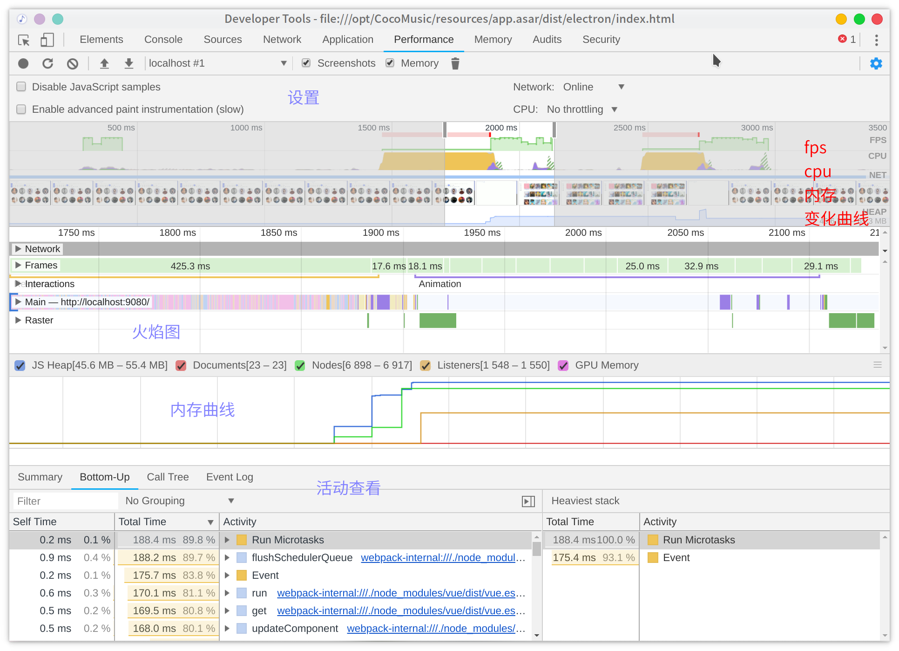
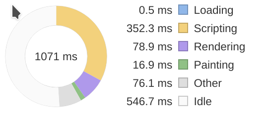
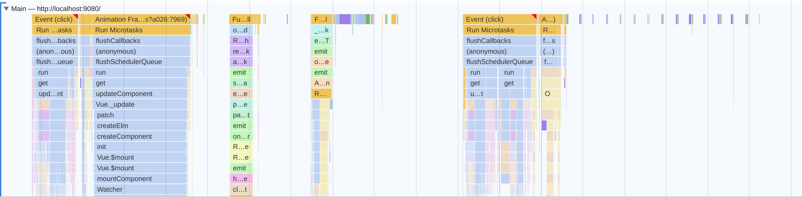
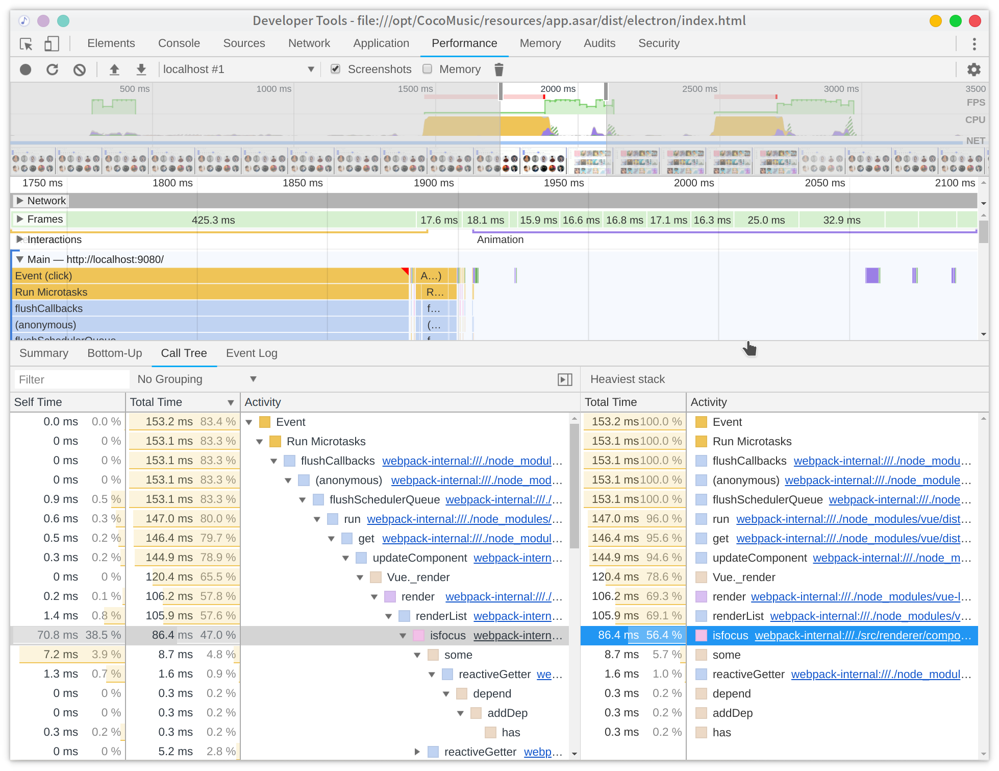

# chrome 性能优化工具
chrome 性能优化工具功能的一个简单的介绍，具体发现问题还得结合实际项目和框架经验。

## devtools Performance 工具的使用
工具一共有这么几个区域

### 设置
依次下来：
  - `Screenshots` 截图
  - `Memory` 内存消耗记录：勾选后可以看到各种内存消耗曲线
  - 垃圾桶图标：在录制页面时，单击 垃圾桶图标以强制进行垃圾收集。
  - `Disable javaScript samples` 关闭 `JavaScript`样本：减少在手机运行时的开销，模拟手机运行时勾选
  - `Network` 网络模拟：可以模拟在3G,4G等网络条件下运行页面。
  - `Enable advanced paint instrumentation(slow)` 启用高级绘制工具，记录渲染事件的细节：选择 `frames` 中的一块，可以看到区域四多了个 `Layers`

### 概览面板

从上往下：
  - `FPS`：绿色曲线是每秒帧数，出现红杠就是说明fps低。
  - `cpu` 曲线：`cpu` 曲线不同颜色代表的渲染过程占用的 `cpu` 处理时间，具体的意义见[网页渲染
](/web/web-render/)。
  - `NET`： 网络，颜色代表的意义如下
    - `HTML`：蓝色
    - `CSS`：紫色
    - `JS`：黄色
    - `图像`：绿色
  - 截图
  - `HEAP`堆内存变化

### 火焰图
 - `Frames`：帧线程，鼠标悬浮绿色块可以看到`fps`
 - `Main`：页面主线程上发生的活动，`x轴`表示随时间的记录。`y轴`表示调用堆栈。顶部的事件造成了它下面的事件。即顶部以下的都是他的子事件。
  
  从火焰图上能看出某中活动占用的 `cpu` 时间，例如黄色的 `script` 处理占了大部分，紫色的渲染其次。
 - `Raster`：光栅化占用时间，具体的意义见[网页渲染](/web/web-render/)
 - `Interactions`： 录制期间发生的用户交互，交互底部的红线表示等待主线程所花费的时间。

### 活动查看部分
 - `Summary` 统计图：展示各个事件阶段耗费的时间
 - `Bottom-Up` 排序：可以看到各个事件消耗时间排序
    - `self-time` 指除去子事件这个事件本身消耗的时间
    - `total-time` 这个事件从开始到结束消耗的时间（包含子事件）
 - `Call Tree` 调用栈：`Main`选择一个事件，可以看到整个事件的调用栈（从最顶层到最底层，而不是只有当前事件）
 - `Event Log`事件日志
    - 多了个`start time`，指事件在多少毫秒开始触发的
    - 右边有事件描述信息
 - `Heaviest stack`: 每当你点击一个活动项时可以展开这个选项卡查看活动调用栈，很有用，不用一层一层的点了

## 通过实例来发现问题

拿 [CoCoMusic](https://github.com/xtuJSer/CoCoMusic) 播放器发现的一个性能问题来举例。

反复切换页面来记录性能。

从分析可以发现页面切换的时候 `render` 占用了太多的时间，熟悉 `vue` 的伙伴可以晓得，那玩意就是 `vdom` 在 `webpack` 编译之后生成的 渲染函数。`vue` 的渲染函数的执行占用了太多的时间尤其是里面有一个叫做 `isfocus` 的函数。从代码可以定位到这个 `isfocus` 确实是在在 模板里面出现 了很多次 `v-show="isfocus(music.songMid)"` 来判断是否歌曲被用户收藏。这是不科学的，当时没有考虑到收藏歌曲过多的情况。

优化前的render函数在一次页面切换中占用106.2ms

优化后的render函数在一次页面切换中只占用26.3ms

## 参考
 - [Performance Analysis Reference](https://developers.google.com/web/tools/chrome-devtools/evaluate-performance/reference?hl=zh-cn#duration)
 - [时间线事件参考](https://developers.google.com/web/tools/chrome-devtools/evaluate-performance/performance-reference?hl=zh-cn#rendering_1)（Steins;Gate？好特么中二的翻译，以前performance工具叫timeline，一个性能分析工具叫这个名字）

在《时间线事件参考》 里面有关于
 - Loading 事件
 - Scripting 事件
 - Rendering 事件
 - Painting 事件
之类的事件分类的说明