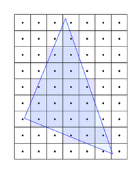
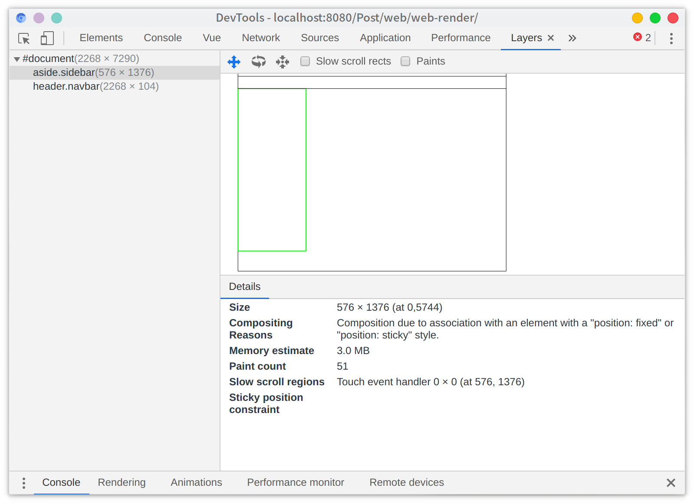

# 网页渲染

用一张经典的图来表示网页的渲染过程


就从这两张图开始装起，主要的渲染过程有
 - 构建渲染树(`Render Tree`)
 - `Layout`：根据生成的渲染树，进行`Layout`（布局，排版），得到节点的几何信息（位置，大小）
 - `Painting`（绘制）:根据渲染树以及`Layout`得到的几何信息，得到节点的绝对像素，顔色
 - `Composite`： 根据一些规则（一般是同一坐标空间属于同一渲染层，我们可以在`chrome devtools layers`看到）将渲染树分离成一些合成层（`layers`）

## 构建渲染树
 解析HTML，生成DOM树，解析CSS，生成CSSOM树， DOM 树与 CSSOM 树合并后形成渲染树。
为构建渲染树，浏览器大体上完成了下列工作：


1. 从 `DOM` 树的根节点开始遍历每个可见节点。
    - 某些节点不可见（例如脚本标记、元标记等），因为它们不会体现在渲染输出中，所以会被忽略。
    - 某些节点通过 `CSS` 隐藏，因此在渲染树中也会被忽略，例如，上例中的 `span` 节点不会出现在渲染树中，因为有一个显式规则在该节点上设置了`display: none`属性。

2. 对于每个可见节点，为其找到适配的 `CSSOM` 规则并应用它们。
3. 发射可见节点，连同其内容和计算的样式。
::: tip
简单提一句，请注意 `visibility: hidden` 与 `display: none` 是不一样的。前者隐藏元素，但元素仍占据着布局空间（即将其渲染成一个空框），而后者 (`display: none`) 将元素从渲染树中完全移除，元素既不可见，也不是布局的组成部分。
:::

## Layout

有了渲染树，我们就可以进入`Layout(布局)`阶段。到目前为止，我们计算了哪些节点应该是可见的以及它们的样式，但我们尚未计算它们在设备视口内的确切位置和大小,这就是“布局”阶段，也称为“自动重排”。

为弄清每个对象在网页上的确切大小和位置，浏览器从渲染树的根节点开始进行遍历。让我们考虑下面这样一个简单的实例：

```html
<!DOCTYPE html>
<html>
  <head>
    <meta name="viewport" content="width=device-width,initial-scale=1">
    <title>Critial Path: Hello world!</title>
  </head>
  <body>
    <div style="width: 50%">
      <div style="width: 50%">Hello world!</div>
    </div>
  </body>
</html>
```
以上网页的正文包含两个嵌套 `div`：第一个（父）`div` 将节点的显示尺寸设置为视口宽度的 50%， 父 `div` 包含的第二个 `div`, 将其宽度设置为其父项的 50%；即视口宽度的 25%。


布局流程的输出是一个“盒模型”，它会精确地捕获每个元素在视口内的确切位置和尺寸：所有相对测量值都转换为屏幕上的绝对像素。

## Painting

### 光栅化

最后，既然我们知道了哪些节点可见、它们的计算样式以及几何信息，我们终于可以将这些信息传递给最后一个阶段：将渲染树中的每个节点转换成屏幕上的实际像素。这一步通常称为“绘制”或“栅格化”或“光栅化”。



把近视眼镜取掉看起来就是一个三角形。简单点的说就是把你上一步得到的几何数据包括（颜色、图像、边框和阴）填充成屏幕可以显示的像素

### 分层

绘制过程是在多个层上完成的，（可以类比为 ps 的图层），一些常见的会导致分层的因素如下：
 - 根元素（HTML）
 - 有明确的定位属性（relative、fixed、sticky、absolute）
 - 透明的（opacity 小于 1）
 - 有 CSS 滤镜（fliter）
 - 有 CSS transform 属性（不为 none）
 - 有 CSS reflection 属性
 - 当前有对于 opacity、transform、fliter、backdrop-filter 应用动画
 - 等等

`Chromium devtools layers`工具显示这个沙雕博客表面上一共两个渲染层
fixed的顶栏和fixed侧边栏



## Composite
混成就是将上一步得到的多个层合并成一个图层然后显示到屏幕上


## 参考
 - [渲染树构建、布局及绘制
](https://developers.google.com/web/fundamentals/performance/critical-rendering-path/render-tree-construction?hl=zh-cn)
 - [composite](http://jartto.wang/2017/09/29/expand-on-performance-composite/)
 - [万能的淘宝](http://taobaofed.org/blog/2016/04/25/performance-composite/)